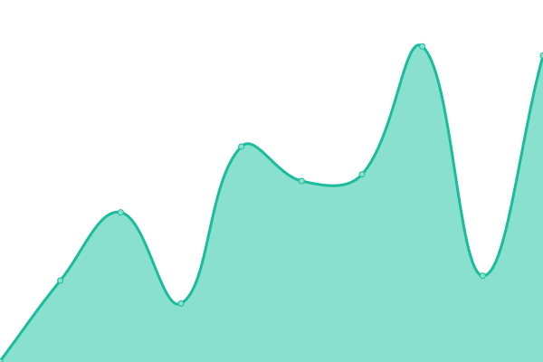

# [📈 Live Status](https://snipcart.github.io/status-page): <!--live status--> **🟩 All systems operational**

This repository contains the open-source uptime monitor and status page for [Snipcart](https://snipcart.com/), powered by [Upptime](https://github.com/upptime/upptime).

With [Upptime](https://upptime.js.org), you can get your own unlimited and free uptime monitor and status page, powered entirely by a GitHub repository. We use [Issues](https://github.com/snipcart/status-page/issues) as incident reports, [Actions](https://github.com/snipcart/status-page/actions) as uptime monitors, and [Pages](https://snipcart.github.io/status-page) for the status page.

<!--start: status pages-->
<!-- This summary is generated by Upptime (https://github.com/upptime/upptime) -->
<!-- Do not edit this manually, your changes will be overwritten -->
<!-- prettier-ignore -->
| URL | Status | History | Response Time | Uptime |
| --- | ------ | ------- | ------------- | ------ |
|  [Merchant Dashboard (app.snipcart.com)](https://app.snipcart.com/) | 🟩 Up | [merchant-dashboard-app-snipcart-com.yml](https://github.com/snipcart/status/commits/HEAD/history/merchant-dashboard-app-snipcart-com.yml) | 

 162ms
     
 | 

<a href="https://status.snipcart.com/history/merchant-dashboard-app-snipcart-com">100.00%</a>
    

|  [Snipcart.com](https://snipcart.com/) | 🟩 Up | [snipcart-com.yml](https://github.com/snipcart/status/commits/HEAD/history/snipcart-com.yml) | 

 137ms
     
 | 

<a href="https://status.snipcart.com/history/snipcart-com">100.00%</a>
    

|  [Documentation](https://docs.snipcart.com/) | 🟩 Up | [documentation.yml](https://github.com/snipcart/status/commits/HEAD/history/documentation.yml) | 

 212ms
     
 | 

<a href="https://status.snipcart.com/history/documentation">100.00%</a>
    

|  [Support Forum](https://support.snipcart.com/) | 🟩 Up | [support-forum.yml](https://github.com/snipcart/status/commits/HEAD/history/support-forum.yml) | 

 331ms
     
 | 

<a href="https://status.snipcart.com/history/support-forum">100.00%</a>
    

<!--end: status pages-->

[**Visit our status website →**](https://status.snipcart.com/)

## 📄 License

- Powered by: [Upptime](https://github.com/upptime/upptime)
- Code: [MIT](./LICENSE) © [Snipcart](https://snipcart.com/)
- Data in the `./history` directory: [Open Database License](https://opendatacommons.org/licenses/odbl/1-0/)
